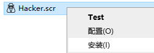
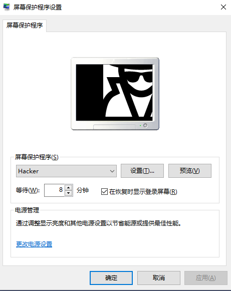
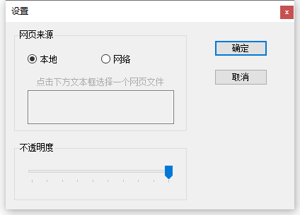

# Hacker Screen Saver

.NET develops a screen saver. 

Hacker Screen Saver 是一款 .NET 设计的屏幕保护程序，可以显示 HTML 页面，你可以将黑客模拟器的网页，或者爱心代码网页设置为你的 Windows 电脑屏保。

软件代码介绍的相关文章：[《用.NET设计一个假装黑客的屏幕保护程序》](https://mp.weixin.qq.com/s/WAsWQINJA3cletktYb-TKw)

已添加设置功能，可以选择本地网页也可以设置自定义的 URL 地址。软件自身提供 2 个网页屏保。

# 使用介绍

软件超轻量不足 1MB 大小，无需安装。下载解压软件，将其放到任意位置留存即可。

右键点击 `Hacker.scr` 选择 `安装`



在下方界面设置好等待时间，点击确定即可。



若勾选了“在恢复时显示登录屏幕”，则在恢复时则会显示电脑登录界面。此方法可以一定程度上在你离开电脑时保护你的隐私。此时建议配合电源管理，设置好关闭屏幕的时间以延长屏幕的使用寿命。

另外注意出现屏保的时间和屏幕超时的时间长短问题，要是等待 5 分钟出屏保，设置的 2 分钟关闭屏幕，那你肯定看不到屏保界面了。

# 软件设置介绍

在屏幕保护程序设置中，点击“设置”，或右键 `Hacker.scr` 选择“设置”即可打开程序的设置界面。



### 网页来源

网页来源可以选择本地和网络，选择本地则需要点击文本框选择一个 html 网页，屏保会展示这个网页内容。如果不选择，则默认使用软件目录下的 `html\hacker.html` 网页。

使用网络来源则可以在文本框输入网址。

### 不透明度

不透明度滑块，可以设置屏保界面的不透明度，滑动范围为 10% 到 100% 的值。

# 自带屏保介绍

### 默认 Hacker Typer


默认本地网页设置，位于 `html\hacker.html`，原型来自古老版本的 [NEO Hacker Typer](https://geektyper.com/scp/) 并做了 IE 适配。

更多效果可前往 [GeekTyper](https://geektyper.com/) 

### 爱心代码 Love


提供的一个可选本地网页，位于 `html\love.html`，可以显示你们在一起的时长，内容文案可自行修改该文件。

#### 1. 修改时间

时间位于第61和62行，设置你们在一起的时间，即可计算过去了多久：

```js
together.setFullYear(2018,2,9);
together.setHours(20,0,0,0);
```

> 注意 `setFullYear` 中的语法：`Date.setFullYear(year, month, day)`

<table>
<tbody><tr>
<th style="width: 22%;">参数</th>
<th>描述</th>
</tr>

<tr>
<td><i>year</i></td>
<td>必需。表示年份的值，允许负值。</td>
</tr>

<tr>
<td><i>month</i></td>
<td>
<p>可选。表示月份的整数。</p>
<p>预期值是 0-11，但允许其他值：</p>

	<ul class="listintable">
	<li>-1 将导致上一年的最后一个月</li>
	<li>12 将导致明年的第一个月</li>
	<li>13 将导致明年的第二个月</li>
	</ul>
</td>
</tr>

<tr>
<td><i>day</i></td>
<td>
<p>可选。整数，表示月中的哪一天。</p>
<p>预期值是 1-31，但允许其他值：</p>

	<ul class="listintable">
	<li>0 将导致上个月的最后一天</li>
	<li>-1 将导致上个月的最后一天的前一天</li>
	</ul>

<p>如果一个月有 31 天：</p>

	<ul class="listintable">
	<li>32 将导致下个月的第一天</li>
	</ul>

<p>如果一个月有 30 天：</p>

	<ul class="listintable">
	<li>32 将导致下个月的第二天</li>
	</ul>
</td>
</tr>
</tbody></table>

> 注意 `setHours` 中的语法：`Date.setHours(hour, min, sec, millisec)`

<table>
<tbody><tr>
<th style="width: 22%;">参数</th>
<th>描述</th>
</tr>

<tr>
<td><i>hour</i></td>
<td>
<p>必需。表示小时的整数。</p>
<p>期望值是 0-23，但允许其他值：</p>

	<ul class="listintable">
	<li>-1 将导致前一天的最后一个小时</li>
	<li>24 将导致第二天的第一个小时</li>
	</ul>
</td>
</tr>

<tr>
<td><i>min</i></td>
<td>
<p>可选。表示分钟的整数。</p>
<p>期望值是 0-59，但允许其他值：</p>

	<ul class="listintable">
	<li>-1 将导致前一小时的最后一分钟</li>
	<li>60 将导致下一小时的第一分钟</li>
	</ul>
</td>
</tr>

<tr>
<td><i>sec</i></td>
<td>
<p>可选。表示秒的整数。</p>
<p>期望值是 0-59，但允许其他值：</p>

	<ul class="listintable">
	<li>-1 将导致前一分钟的最后一秒</li>
	<li>60 将导致下一分钟的第一秒</li>
	</ul>
</td>
</tr>

<tr>
<td><i>millisec</i></td>
<td>
<p>可选。表示毫秒的整数。</p>
<p>期望值为 0-999，但允许其他值：</p>

	<ul class="listintable">
	<li>-1 将导致前一秒的最后一毫秒</li>
	<li>1000 将导致下一秒的第一毫秒</li>
	</ul>
</td>
</tr>
</tbody></table>

#### 2. 修改名称

称谓在77和78行，75和76行可以改为你们的纪念时间，比如在一起，求婚等等。

第105、109和110行可修改为时间的说明文案。

# 注意

为了程序简易仍软件采用了 WebBrowser，故自行设计网页的时候，请考虑 IE 的兼容性，并添加如下代码在网页中：

```html
<meta http-equiv="X-UA-Compatible" content="IE=edge"/>
```

测试时可以使用 IE 打开网页，也可以通过软件设置本地页面为测试网页后，右键点击 `Hacker.scr` 选择 `Test` 即可查看效果。